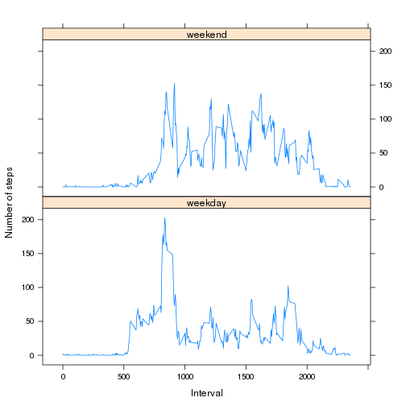

### Loading and preprocessing the data

Load the data and merge the date and interval columns to produce a single date/time

```r
activity<-read.csv("activity.csv", colClasses=c('integer','Date','integer'))
```

```
## Warning in file(file, "rt"): cannot open file 'activity.csv': No such file
## or directory
```

```
## Error in file(file, "rt"): cannot open the connection
```

```r
activity$datetime <- as.POSIXct(tz="GMT", origin=activity$date, 
                          as.integer(activity$interval/100)*3600 + 
                          activity$interval%%100*60)
summary(activity)
```

```
##      steps             date               interval     
##  Min.   :  0.00   Min.   :2012-10-01   Min.   :   0.0  
##  1st Qu.:  0.00   1st Qu.:2012-10-16   1st Qu.: 588.8  
##  Median :  0.00   Median :2012-10-31   Median :1177.5  
##  Mean   : 37.38   Mean   :2012-10-31   Mean   :1177.5  
##  3rd Qu.: 12.00   3rd Qu.:2012-11-15   3rd Qu.:1766.2  
##  Max.   :806.00   Max.   :2012-11-30   Max.   :2355.0  
##  NA's   :2304                                          
##     datetime                  
##  Min.   :2012-10-01 00:00:00  
##  1st Qu.:2012-10-16 05:58:45  
##  Median :2012-10-31 11:57:30  
##  Mean   :2012-10-31 11:57:30  
##  3rd Qu.:2012-11-15 17:56:15  
##  Max.   :2012-11-30 23:55:00  
## 
```

```r
clean_activity<-activity[!is.na(activity$steps), c("interval", "steps", "date")]
```

### What is mean total number of steps taken per day?

Ignore the missing values in the dataset and produce a histogram, then calculate and report the mean and median number of steps.


```r
hist(clean_activity$steps, main="Frequency of steps", xlab="Number of steps")
```

 

```r
mean(clean_activity$steps)
```

```
## [1] 37.3826
```

```r
median(clean_activity$steps)
```

```
## [1] 0
```


### What is the average daily activity pattern?


```r
clean_steps_by_interval<-aggregate(list(Avg.Steps=clean_activity$steps), by=list(Time.of.day=clean_activity$interval), FUN=mean)
plot(Avg.Steps ~ Time.of.day, clean_steps_by_interval, type="l")
```

 


### Imputing missing values


```r
nas<-is.na(activity$steps)
sum(nas)
```

```
## [1] 2304
```

We will impute the missing values by calculating the average number of steps for that day.   This should keep the distribution the same.


```r
# We will use the average for the supplied date to try and keep the po
impute_table<-aggregate(list(steps=clean_activity$steps), by=list(date=clean_activity$date), FUN=mean)
# Set the row names of the impute table so that we can do lookups from it
row.names(impute_table)<-impute_table$date
# If a step column is NA then look it up from the table, if that value is NA then zero
impute_steps<-function (row) {
  if (is.na(row["steps"])) {
    s<-impute_table[row["date"], "steps"]
    if (is.na(s)) {
      as.integer(0)
    } else {
      as.integer(s)
    }
  } else {
    as.integer(row["steps"])
  }
}
imputed_activity<-activity
imputed_activity$steps<-as.integer(apply(activity, 1, impute_steps))
```

Now we produce a histogram of the adjusted data (plus mean/median results).


```r
hist(imputed_activity$steps, main="Frequency of steps", xlab="Number of steps")
```

 

```r
mean(imputed_activity$steps)
```

```
## [1] 32.47996
```

```r
median(imputed_activity$steps)
```

```
## [1] 0
```

This shows that adding the imputed data pushed the mean lower, however the frequency distribution shape was unchanged.   As expected.

### Are there differences in activity patterns between weekdays and weekends?

```r
# First get a vector of the days of week
dow<-as.integer(strftime(imputed_activity$datetime, "%w"))
# Then construct daytype factor based on whether the dow is 0 (Sunday) or 6 (Saturday)
imputed_activity$daytype<-factor(dow==0|dow==6,levels=c(FALSE, TRUE),labels=c("weekday", "weekend"))
```

Now make a panel plot showing the different activity based on whether the measurement was a weekend or not.


```r
imputed_weekend_by_interval<-aggregate(steps ~ interval + daytype, data= imputed_activity[, c("steps", "daytype", "interval")], FUN=mean)
xyplot(steps~interval|daytype, imputed_weekend_by_interval, type="l", ylab="Number of steps", xlab="Interval", layout=c(1, 2))
```

 
